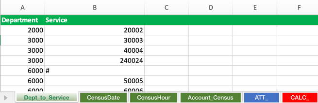

## Input files documentation

#### Required files 

The script requires 2 files be present in the input directory to generate fact data for your model, with the following naming convention:

1. <MODEL_NAME>_fields.xlsx - contains a column delimited list of fields for the fact data headers
2. <MODEL_NAME>_dim.xlsx - contains dimensions, measures, relationships, and constraints

For the examples, the model names are **SERVICE_TIMES** and **CENSUS_STAFFING**

* [SERVICE_TIMES example](#service_times) - Demonstrates how to generate a data set with a calculated dimension and basic random number generation parameters
* [CENSUS_STAFFING example](#census_staffing) - Demonstrates how to create a data set with a dimensional attribute that is used to dynamically control the max and min values per dimension

##### SERVICE_TIMES

###### SERVICE_TIMES_fields.xlsx

This file contains the column headers and structure of the output.

1. Define each dimension header, with one name per column.
2. The Account dimension should be the final one in the list, as highlighted in green below.
3. Add any calculated dimensions that will require defining to the right, as highlighted in red below. Calculated dimensions, in this context, are numeric and typically used for classification or grouping of rows.

	

###### SERVICE_TIMES_dim.xlsx

This file contains the dimension members, relationships between dimensions, and the units and constraints of generated measures. The 2 examples highlight all of the features currently available in the data generator.

The first example continues with the SERVICE_TIMES model. The top row of each dimension sheet (green coding) is replaced by the headers specified in the _fields.xlsx template.

1. Each dimension sheet contains members that should be kept together when they are joined with the values on the subsequent sheets.

	

In this example, Department 2000 will only appear on the same row as Service 20002. It won't ever appear in the same row as Service 30003.

2. Subsequent dimension sheets, such as **AdmissionDate**, will have a row created for every combination (cartesian product).

	

Here, each row in **Dept_To_Diag** gets a row for all 365 days of 2021.

3. The last dimension sheet contains your list of accounts (i.e. measures) and their unit of measurement

	

Unit is a reserved column and the header shouldn't be changed. It contains one value for every type of measure value you want to generate. In the example, there are 3 accounts that are in **minutes**, 2 that are a **count** of some value, and 1 in **days**.

4. The final sheet in the workbook is always named **CALC_** and is red. It contains the rules for generating the numbers for each measure. 

	

The column headers on this tab are all reserved keywords in the source code and should not be changed.

The following parameters are available:

* Name - should match either the dimension name of a calculated dimension, or the unit of an account.
* Type - dimension or measure. Controls whether the value is inserted in every row (dimension), or as one of the accounts (measure).
* Options - stringified JSON for [random-number](https://www.npmjs.com/package/random-number) package. Valid options are covered in the documentation.
** min and max also accept a reserved value of "property" which is covered in the 2nd example.
* Ratio - In the BoarderFlag example, the random number generates values between 0.0 and 1.0 and any value less than 0.95 is made zero. This is helpful when you want the majority of values to be a 0 with only a few exceptions. Accepts any value between 0.0 and 1.0.
* DecimalPlaces - Number of decimal places returned when "integer" is **false**
* Properties - allows max and min to be dynamically set based on a Dimension attribute. Covered in **CENSUS_STAFFING** example. Must be 0 if not in use.

##### CENSUS_STAFFING

###### CENSUS_STAFFING_fields.xlsx


Same as the previous example but without a calculated dimension. Last column contains the account dimension.

###### CENSUS_STAFFING_dim.xlsx

1. This model does not contain the Diagnostic information of the previous one, so the **Dept_to_Service** relationships are simpler.

	

2. **CensusDate** is the same as **AdmissionDate** in the previous example.

3. The addition of **CensusHour** creates data for each hour of each day.

	

4. The account contains 5 measures with 3 distinct units, **patients**, **count**, and **nurses**.

	

5. The addition of a sheet named **ATT_** is inserted between the account dimension and the **CALC_** sheet. This allows numeric attributes to be maintained per dimension member.

	

In this example, 2 attributes, **MaxOccupancy** and **ServiceCount** are maintained. Attributes are prefixed with the dimension name to which they are associated. Additional attributes can be maintained horizontally, following the same naming convention.

6. The **CALC_** sheet has an example of how to dynamically set the min and max values for a measure based on attributes.

	

To implement this setting, adjustments to **Options** and **Properties** are necessary.

* **Options** - set min, max, or both values to "property" to enable this functionality.
* **Properties** - Stringified JSON object in the format:

```
{"dimension": "Department", 
"Options": {"min": "Department_ServiceCount", "max": "Department_MaxOccupancy/Department_ServiceCount"}}
```

Where dimension is one of the values in **CENSUS_STAFFING_fields.xlsx** and min and max refer to attributes specified in the **ATT_** sheet. As in the example, the values can be virtually any equation that can be evaluated by https://mathjs.org/index.html evaluate() function.

Next, check the [output](../output/) from the generator.