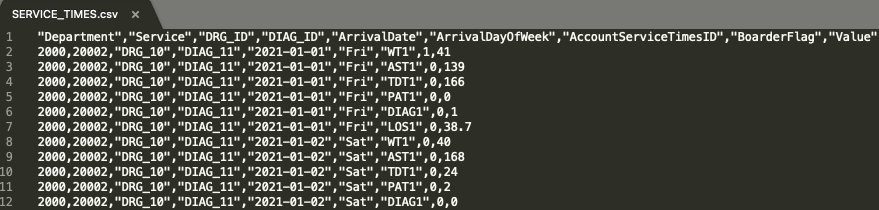
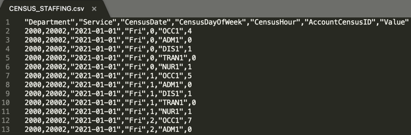

##### Checking generated output

If you made it this far, you should have output CSV files in this directory. Here are 2 examples:

###### SERVICE_TIMES.csv

###### CENSUS_STAFFING.csv

Note that the **Value** column is added automatically at the end of each file and each row is consistent with the options and properties defined in the input files.

Finally, use your dimensions to build a model in SAP Analytics Cloud. You can find example dimensions and measures in the [model](../model/) directory.